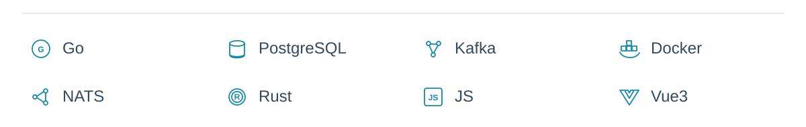

<picture>
  <source media="(prefers-color-scheme: dark)" srcset="./assets/hero-dark.svg">
  <source media="(prefers-color-scheme: light)" srcset="./assets/hero-light.svg">
  
</picture>

<!--### Selected work -->

<!-- Add your public projects here when ready. -->

<picture>
  <source media="(prefers-color-scheme: dark)" srcset="./assets/stack-dark.svg">
  <source media="(prefers-color-scheme: light)" srcset="./assets/stack-light.svg">
  
</picture>

